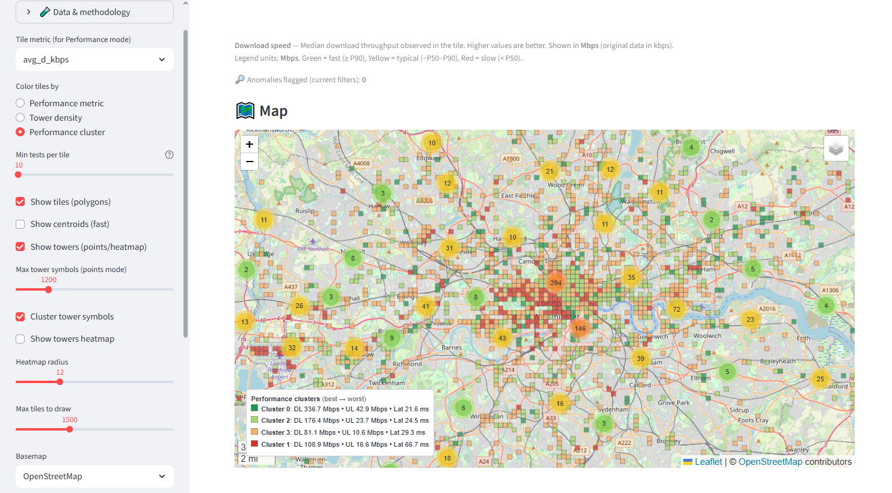
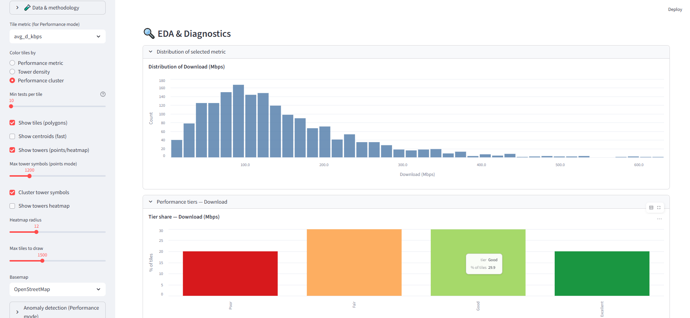
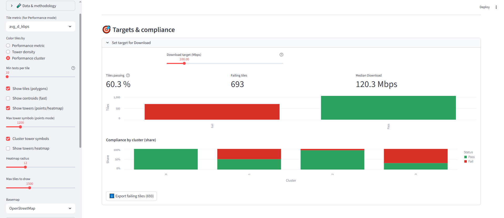
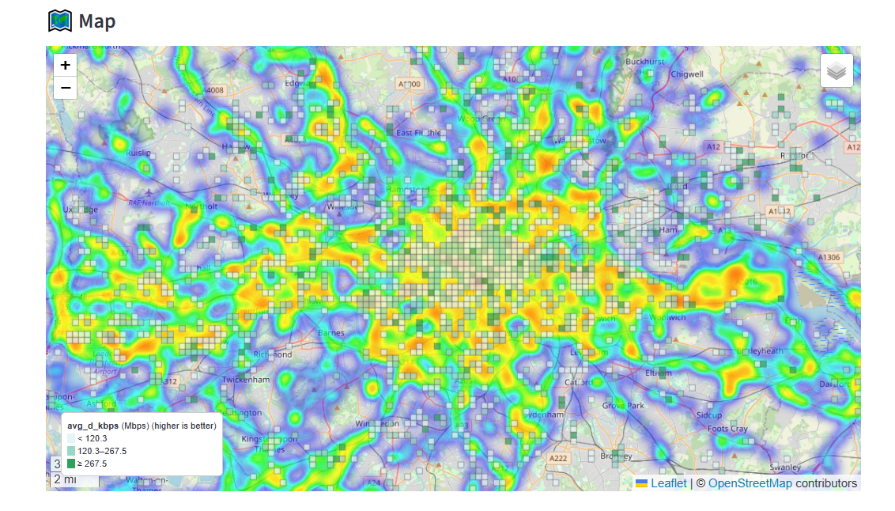

# 📶 Telecom KPI Dashboard — London (Open Data)

Interactive Streamlit dashboard that maps **mobile network performance** in Greater London using **Ookla Open Data** (tiles) and **OpenCelliD** (cell sites).  
It includes anomaly highlighting, **performance clustering**, EDA panels, and a **Targets & Compliance** module — all wired for clean exports and deploy-ready.

> ⚠️ Data usage: Ookla Open Data and OpenCelliD have **separate, non-commercial terms**. Make sure your use complies with their licenses.

---

👉 **Live demo:** 
[
---
## ✨ Features

- **Map views**
  - Color by **Performance metric** (DL/UL in **Mbps**, latency in **ms**) with quantile-based legend
  - Color by **Tower density** (OpenCelliD points counted per tile)
  - **Performance clusters** (k-means on DL, UL, Latency) ranked **best → worst** with **green → red** legend

- **Diagnostics & EDA**
  - Metric distribution histograms with human-readable bin labels
  - Tier share charts
  - Coverage vs performance (tower_count vs KPI + smoothed trend)
  - Short correlation note between KPI and tower density

- **Anomaly detection**
  - z-score thresholding (latency inverted so high latency = bad)
  - Optionally show only anomalies

- **Targets & compliance**
  - Metric-aware thresholds (DL/UL in **Mbps**, Latency in **ms**)
  - Live pass/fail %, per-cluster pass/fail shares, and export of failing tiles

- **Exports**
  - Tiles export (respects your coloring mode and current filters)
  - Cluster summary export (counts, KPI means, median towers)

- **Robust geo**
  - Fast point-in-polygon tower counts using STRtree
  - Safe caching keyed by tile set to avoid stale index errors

---

## 🧭 Demo tour

- **Left sidebar**: select the KPI, color mode, basemap, min tests per tile, and toggles for tiles/centroids/towers.
- **Map**: hover tiles to see KPI, tests/devices, tower count, and anomaly flag (if enabled).
- **Summary**: quick medians across all tiles (DL/UL/Latency).
- **EDA section**: metric distribution, tier share, coverage vs performance.
- **Clusters**: when cluster mode is enabled, see a ranked legend + “Cluster summary” panel.
- **Targets**: set a KPI target and get pass/fail shares + export of failing tiles.

---

## 📂 Project structure

```
telecom-kpi-dashboard/
├─ app.py                         # Streamlit entrypoint
├─ telecom_dash/                  # App modules (imported by app.py)
│  ├─ __init__.py
│  ├─ settings.py                 # paths, metrics, bounds, labels/units
│  ├─ io_data.py                  # loading/cleaning tiles & towers
│  ├─ analytics.py                # anomalies, quantiles, correlation
│  ├─ geo_ops.py                  # STRtree point-in-polygon tower density
│  ├─ viz_map.py                  # Folium map + legends
│  ├─ viz_panels.py               # KPI header + exports
│  ├─ docs.py                     # glossary, methodology, metric explainer
│  ├─ eda.py                      # histograms, tiers, coverage vs perf
│  ├─ segmentation.py             # k-means clustering & per-cluster stats
│  ├─ cluster_panels.py           # cluster bar + table + export
│  └─ targets.py                  # SLA-style target & compliance panel
├─ scripts/                       # helper scripts to fetch/prepare data
│  ├─ download_ookla_london.py
│  ├─ fetch_opencellid_london.py
│  └─ filter_opencellid_country_to_london.py
├─ data/                          # local-only artifacts (gitignored)
├─ .streamlit/
│  └─ config.toml                 # theme & server settings
├─ requirements.txt
├─ .gitignore
├─ README.md
├─ LICENSE
├─ .env.example
├─ Dockerfile                     # optional container deploy
└─ .github/workflows/ci.yml       # optional basic CI
```

> `data/` is **gitignored**; use the scripts to populate it locally.

---

## 🛠️ Setup

### 1) Environment

- **Python**: 3.11 (recommended)
- Create a virtual environment:

**Windows (PowerShell):**
```powershell
python -m venv .venv
.\.venv\Scripts\Activate.ps1
pip install -r requirements.txt
```

**macOS/Linux:**
```bash
python3 -m venv .venv
source .venv/bin/activate
pip install -r requirements.txt
```

> The pinned packages in `requirements.txt` have prebuilt wheels for Py 3.11 on major platforms (no C++ build tools required).

### 2) Data

Place artifacts in `data/`:

- `data/ookla_mobile_london_2024q4.parquet` — from Ookla Open Data (tile KPIs)
- `data/opencellid_london.csv` — from OpenCelliD, filtered to London

Use the scripts in `/scripts` to fetch/prepare (see docstrings in each script):

```bash
python scripts/download_ookla_london.py
python scripts/filter_opencellid_country_to_london.py
# Optional (requires API key in .env): python scripts/fetch_opencellid_london.py
```

Copy `.env.example` to `.env` if you need tokens (e.g., `OPENCELLID_API_KEY`).

### 3) Run

```bash
streamlit run app.py
```

Open http://localhost:8501 in your browser.

---

## 📊 KPI definitions & color logic

- **Download / Upload**: median throughputs per tile; displayed in **Mbps** (data is kbps).
  - Legend: **Green** ≥ P90, **Yellow** P50–P90, **Red** < P50
- **Latency**: median round-trip time per tile; displayed in **ms** (lower is better).
  - Legend: **Green** ≤ P10, **Yellow** P10–P50, **Red** > P50

Percentiles (PXX) are computed from **currently visible tiles** after your filters (e.g., min tests).

---

## 🔍 Anomalies, EDA & Clusters

- **Anomalies**: z-score on the selected KPI (latency z is **inverted**). You can show only anomalies.
- **EDA**:
  - **Histogram**: adaptive binning with readable labels (Mbps/ms)
  - **Tier share**: P50/P90 (throughput) or P10/P50 (latency)
  - **Coverage vs performance**: tower_count vs KPI with LOESS trend
- **Clusters**:
  - k-means on (DL, UL, Latency) — standardized
  - Clusters **ranked best → worst** by a composite score (DL↑, UL↑, Lat↓)
  - Map legend & cluster bars use a **green→yellow→red** ramp in ranked order
  - “Cluster summary” shows tile counts, KPI means, median towers, and CSV export

---

## 🎯 Targets & Compliance

Pick a target per KPI and see:
- % of tiles passing,
- failing tiles count,
- median KPI,
- per-cluster pass/fail share,
- export **failing tiles** (with your threshold baked in).

---

## ⬇️ Exports

- **Tiles CSV**: respects current color mode + filter
- **Cluster summary CSV**: tiles per cluster, shares, DL/UL/Latency means (Mbps/ms), median towers

---

## 🖼️ Screenshots 


### Performance Clusters


### EDA — Histogram


### Targets & Compliance


### Towers Heatmap



---

## 🚀 Deploy

### Streamlit Community Cloud
1. Push this repo to GitHub.
2. Create an app in Streamlit Cloud, point it to `app.py`.
3. Add `requirements.txt`.
4. (Optional) Add secrets or environment variables.

### Docker
```bash
docker build -t telecom-kpi-dashboard .
docker run -p 8501:8501 telecom-kpi-dashboard
```

### Hugging Face Spaces / Render / Fly.io
- Use the same `requirements.txt` or the provided `Dockerfile`.

---

## 🧪 CI (optional)

Basic import-smoke test via GitHub Actions is included under `.github/workflows/ci.yml`.  
It installs dependencies and verifies imports on Python 3.11.

---

## 🧰 Troubleshooting

- **IndexError in `geo_ops.py` when changing “Min tests per tile”**  
  Ensure you’re on the version that builds the STRtree **keyed by tile set** (we use a fingerprinted cache key).  
  If you still see oddities, **Clear cache** in Streamlit (☰ → Clear cache) or restart the app.

- **Histogram looks empty or bins weird**  
  This can happen when values are extremely concentrated. The app will show an info note in that case.

- **Correlation warnings (`ConstantInputWarning`)**  
  These occur when a series is constant after filtering. They’re harmless and suppressed in the UI note.

- **Pandas build errors on Windows**  
  Use Python **3.11** with the pinned wheels in `requirements.txt`. Avoid building from source.

---

## 🧱 Extending the project

- **Add a new KPI metric**
  1. Add the column to your tiles parquet.
  2. Register label/unit in `Settings.metric_labels` / `metric_units`.
  3. Add to `Settings.metrics` tuple.
  4. Extend color logic in `viz_map.py` if needed.
  5. (Optional) include in clustering features.

- **Change cluster ranking**
  - Edit `_rank_clusters` in `viz_map.py` and `cluster_panels.py`.
  - You can apply custom weights (e.g., DL 0.5, UL 0.3, Lat 0.2).

- **New data region**
  - Update `Settings.bounds` and the parquet/CSV paths in `settings.py`.
  - Replace data files in `/data`.

---

## 📄 License

Code is provided under the **MIT License** (see `LICENSE`).  
Ookla Open Data and OpenCelliD datasets have **their own licenses**; verify compliance.

---

## 🙏 Acknowledgments

- **Ookla Open Data** — for performance tiles.  
- **OpenCelliD** — for open cell site locations.  
- Community libraries: **Streamlit**, **pandas**, **numpy**, **Altair**, **folium**, **shapely**, **scikit-learn**.

---

## 🧾 Citation

If this dashboard helped your work, please cite the repo and original data sources:

```
Your Name. Telecom KPI Dashboard — London (Open Data). 2025. GitHub repository.
Data: Ookla Open Data; OpenCelliD.
```
